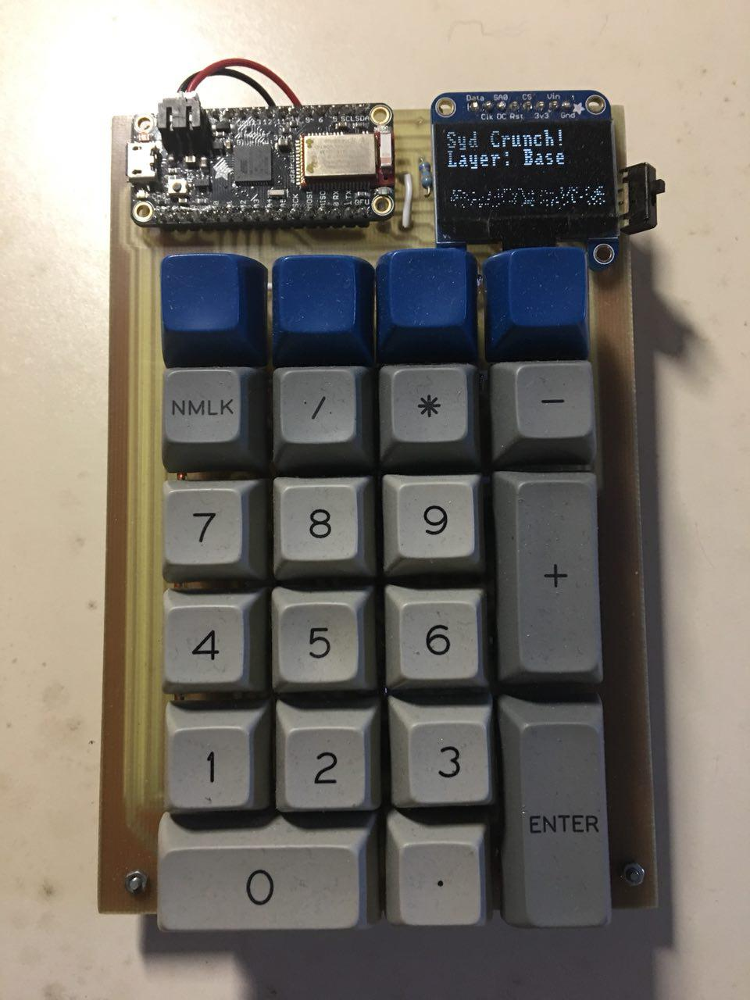

# SydKey
Kicad files for a 4x6 numbpad using bluefruit 32u4 feather

	
## Design
This is a dead simple design is to make a bluetooth programmable number pad with small oled screen. It has 4 function keys and a full number pad layout underneath, it does not support alps switches or alternate layouts.

It was designed with the goal of being etched via my tiny cheap cnc engraver and hand soldered and programmed via QMK, trace width and pad shapes were messed with to make hand soldering more forgivable. It's also designed with the intention of one side being carved and the other side being hand wired, I found in my struggles with my aligning front and back designs in the process.

## BOM
* 6x4 Copper Clad Board
* Diodes
* Cherry Mx compatible switches
* i2c Oled (I used the adafruit 128x64)
* Adafruit Bluefruit 32u4 Feather

## Programming
The board is programmed using the open source firmware QMK, its quite excellent and though I may not be a great programmer, their documentation covers the essential basics and with examples I pulled together some code to get it functioning. However, I know someone can do much better! See more in the QMK code folder.

## Versioning
* V.02 - Added pull up resistors however I think I did them wrong.
* V.01 - Functioning prototype

## TODO
* Fix old kicad diode in schematics so the proper pin is selected in the pcb. Currently on the pcb the diode direction is reversed from how you actually want to solder them.
* Program ios/android shortcuts/clean up default keymap

## Resources
Kicad
Regack's 4x6 numbpad
adafruit kicad lib
teensy kicad lib
geekhack forums
input club design files
deskauthority wiki